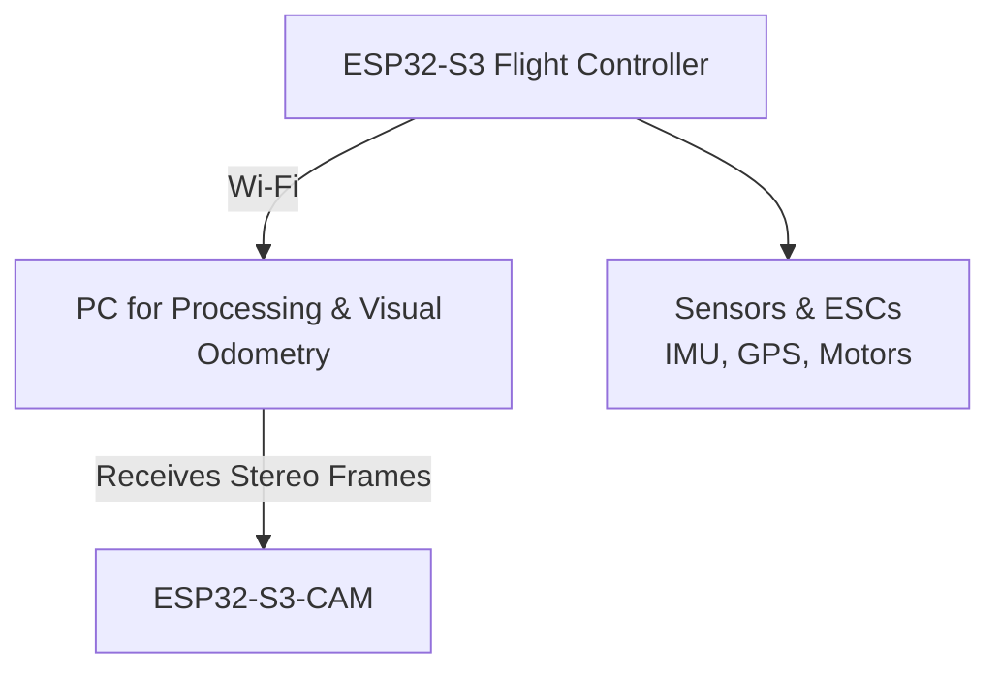
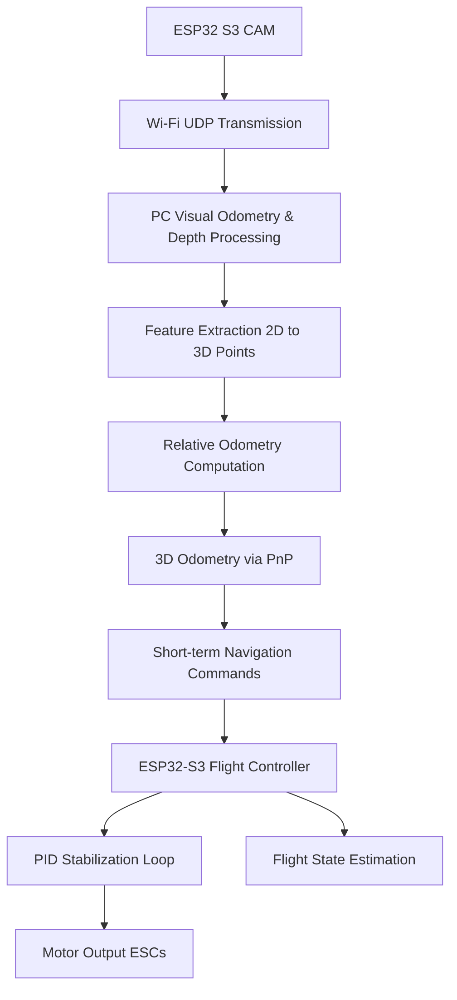

# ESP32-S3 Custom Flight Controller for Autonomous UAV

A fully customizable, low-cost UAV flight controller firmware built on **ESP32-S3** for control, telemetry, and **ESP32-S3-CAM with OVA5640** for visual frame capture. The system uses **Wi-Fi** for all communications, eliminating the need for additional telemetry or video transmission hardware. The firmware is open-sourced to support UAV research on a tight budget.

## Features

- **Low-cost flight control:** Uses ESP32-S3 for sensor fusion, motor control, and telemetry.
- **Visual input:** ESP32-S3-CAM captures frames and streams to a PC over Wi-Fi.
- **Wireless communication:** Full UAV telemetry and control over Wi-Fi.
- **Custom sensor integration:** IMU, GPS, ESCs, and camera interfaces.
- **PID-based stabilization:** Roll, pitch, yaw, and altitude control with configurable gains.
- **Failsafe:** Automatic motor shutdown if communication is lost for >500ms.
- **Open-source:** Firmware design available for other researchers and hobbyists.
---

<p align="center">
  
  
</p>

---
## System Architecture


---
## System Workflow

The following diagram illustrates the UAV system workflow, from sensor capture to autonomous navigation:



---

**Control & Video Flow:**

1. **Sensor Loop:** ESP32-S3 reads IMU and GPS, runs PID loops for stabilization.
2. **Video Transmission:** ESP32-S3-CAM captures frames in JPEG format and transmits them over Wi-Fi via **UDP packets** to the PC.
    - Frames are split into safe-sized chunks (~1000 bytes each) to avoid packet loss.
    - Each packet contains a header with `frame_id`, chunk index, and chunk size for reassembly.
3. **PC Processing:**
    - Depth is computed from stereo frames.
    - 2D/3D feature points are extracted to generate relative odometry.
    - Short-term navigation commands are sent back to the ESP32-S3 flight controller.
4. **Autonomous Flight Loop:**
    - ESP32-S3 receives commands and adjusts motor outputs in real-time.
    - Continuous frame streaming and odometry feedback enable environment mapping and autonomous navigation.

## Hardware Requirements

- ESP32-S3 development board (main controller)
- ESP32-S3-CAM module (for visual input)
- IMU (MPU9250)
- GPS module
- 4x ESCs and brushless motors
- Power supply (LiPo battery)
- Propellers, frame, and mechanical mounts

## Software Requirements

- Arduino IDE or PlatformIO
- ESP32 board support package
- Libraries:
    - `WiFi.h` & `WiFiUdp.h`
    - `Wire.h`
    - `MPU9250`
    - `esp_camera.h`
    - `ESP32_OV5640_AF.h`

## Setup & Usage

1. **Clone the repository**:

```bash
git clone https://github.com/yourusername/esp32-uav-fc.git
cd esp32-uav-fc

```

1. **Configure Wi-Fi** in `main.ino` and `camera.ino`:

```cpp
const char* ssid = "YourWiFiSSID";
const char* password = "YourWiFiPassword";

```

1. **Set PC IP and Ports**:

```cpp
IPAddress pcIP(192, 168.4.2);  // Flight controller commands
const uint16_t pcPort = 10001;

const char* receiverIP = "192.168.4.2";  // Video stream
const uint16_t receiverPort = 12345;

```

1. **Upload firmware** to ESP32-S3 board using Arduino IDE or PlatformIO.
2. **Power up the UAV**, ensure communication with PC, verify motor calibration, and check video stream.

## Flight Controller Features in Code

- PWM generation for 4 rotors using ESP32 LEDC.
- PID loops for roll, pitch, yaw, and altitude stabilization.
- UDP task for receiving control commands and sending telemetry.
- Video capture and UDP transmission from ESP32-S3-CAM.
- Failsafe motor shutdown if UDP packet is lost.
- Configurable offsets and tuning parameters for custom UAV designs.

## Contributing

Contributions are welcome!

- Report issues via GitHub Issues.
- Fork the repository and submit pull requests for improvements.
- Share custom PID tuning or sensor integration examples.

## License

This project is **open-source** under the MIT License.
